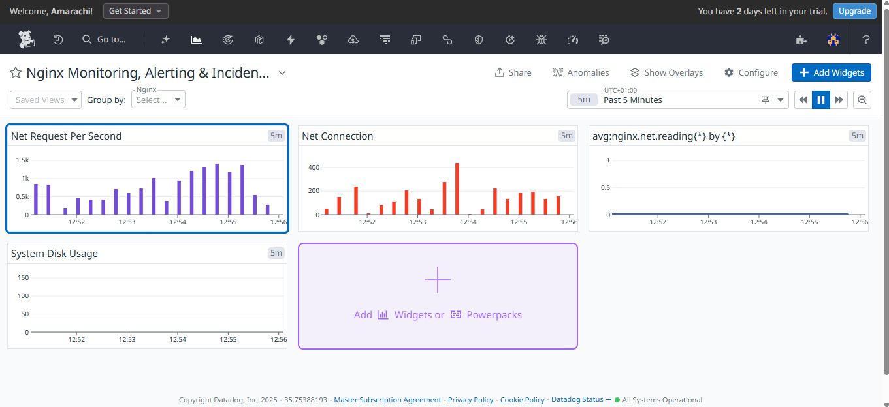
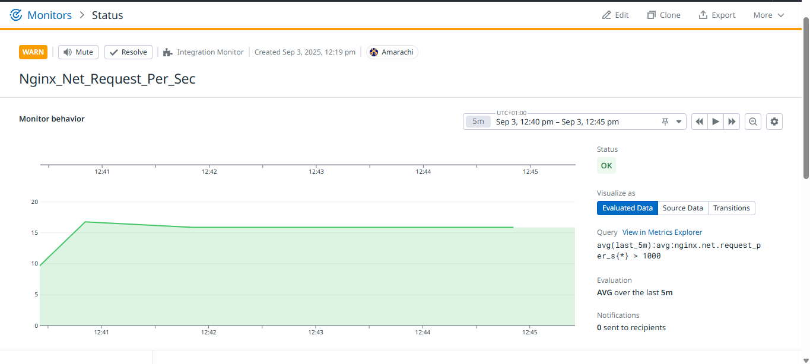

Monitoring & Intelligent Alerting with Nginx, Datadog, and Slack

📌 Project Overview

In modern IT environments, uptime and performance are critical. Businesses lose millions in revenue and reputation due to unnoticed outages, slow response times, or excessive alert noise.

This project implements a containerized monitoring solution that integrates:

▪️Nginx as a web service

▪️Datadog Agent for metrics, logs, and performance monitoring

▪️Slack integration for real-time, intelligent alerting

By combining these tools with Docker Compose, the setup is repeatable, portable, and production-ready in minutes.

 Business Problem & Impact

The Problem :

▪️Teams are often blindsided by downtime because they lack visibility into their applications.

▪️Alert fatigue from too many non-critical alerts makes engineers ignore real incidents.

▪️Manual setups are time-consuming, error-prone, and not scalable.

The Solution :

This project provides:
✅ Proactive monitoring: Track Nginx health with real-time metrics.
✅ Intelligent alerting: Only send actionable alerts to Slack, reducing noise.
✅ Faster response times: Engineers can act within minutes of an incident.
✅ Infrastructure-as-Code: Deploy the full monitoring stack with a single command.

Business Impact :

▪️Reduced downtime → improved customer trust and revenue protection.

▪️Increased team efficiency → engineers focus on innovation instead of firefighting.

▪️Faster incident resolution → lower operational costs.

 Technical Implementation

Project Structure

monitoring-project/ │ 
├── docker-compose.yml # Orchestration file 
├── .env.example # Template for environment variables 
├── README.md # Documentation 
│ ├── nginx/ 
│ └── default.conf # Nginx config with /nginx_status enabled 
│ └── datadog/ └── conf.d/nginx.d/conf.yaml # Datadog integration for Nginx 

Key Components

▪️Nginx container → Serves as the monitored web service.

▪️Datadog Agent container → Collects metrics & logs.

▪️Slack integration → Delivers filtered alerts directly to engineers.

▪️Docker Compose → Single-command reproducible environment.

 Setup Instructions

1. Clone the Repository

git clone https://github.com/<your-username>/Monitoring-Alerting-with-Datadog-and-Slack.git cd Monitoring-Alerting-with-Datadog-and-Slack
 
2. Configure Environment Variables
cp .env.example .env 
Edit .env and add your Datadog API key:
DD_API_KEY=your_real_datadog_api_key 

3. Start the Stack
docker compose up -d --build 

4. Verify
Nginx app: http://localhost:8080
Nginx status: http://localhost:8080/nginx_status

Datadog GUI → Metrics collected from Nginx

Slack channel → Intelligent alerts from Datadog monitors

📸 Screenshots
✅ Project Architecture 

✅ Datadog dashboard showing Nginx metrics 

✅ Anomaly Monitor for Nginx Request Per Second 

✅ Slack channel receiving alerts 

✅ Nginx status page 

*Up next I will be using Terraform to deploy Infrastructure, host a website on my nginx and automate deployment using CI/CD pipeline*

👨‍💻 Author: Amarachi Ezeonyekwere